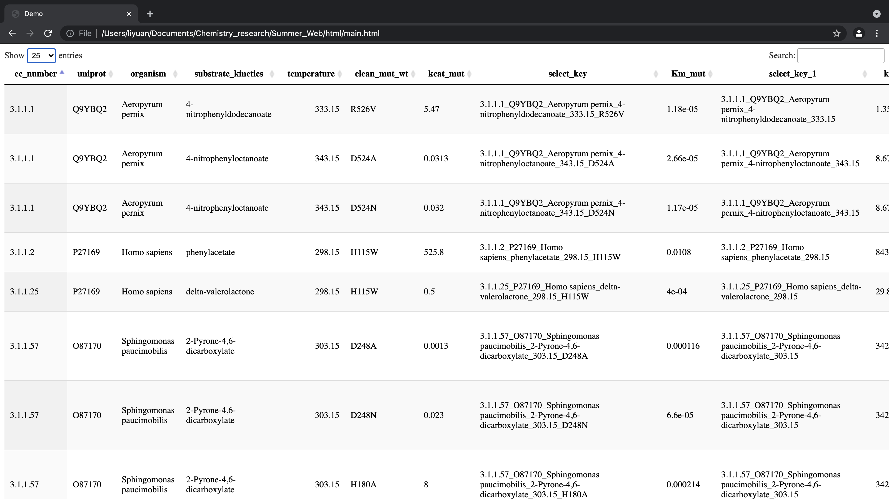

6/28_log

**We used [vs code](https://code.visualstudio.com/) as our development IDE and *Google Chrome* as our interpreter.**

1. Setting up environment using online https://datatables.net/manual/installation resource
1. Creating the main.html and adding jQuery.js following above online resource
2. Using online https://www.convertcsv.com/csv-to-html.htm to convert the PDB csv file to html formatted table
3. Inserting above table into main.html
4. Run this code and debug it as a preview

